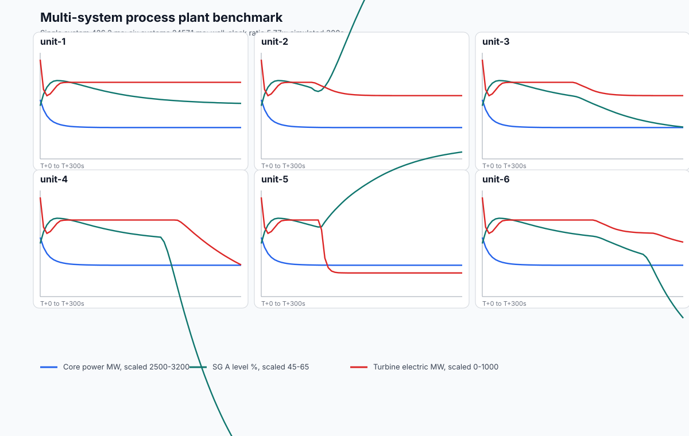

# Process Plant Simulation V1 Design Spec

## Purpose

Leitbild should be able to host process-control simulations that interact with the wider operational world. The first feasibility target is a pressurized water reactor plant, but the pack identity is deliberately broader: `process-plant`.

V1 is not a licensing-grade thermal-hydraulic analysis code. It is a medium-fidelity process-control simulator intended to test whether Leitbild can run, inspect, control, and coordinate coupled plant models credibly enough for control-room workflow research, AI-agent studies, and cross-domain scenario interaction.

The key feasibility question is whether a scenario-owned component graph, typed ports/links, a compiled runtime graph, and a fixed-step solver can make plant evolution understandable, efficient, replayable, and extensible.

## Core Decision

Process plant simulations live inside the `process-plant` pack. Leitbild core remains use-case agnostic.

The architectural decision is recorded in [ADR 0017](./adr/0017-process-plant-component-graph.md).

Inside the pack:

- `PlantGraphSpec` describes plant topology and parameters as validated data.
- component definitions declare parameters, ports, variables, and later solver behavior.
- a graph compiler validates raw specs and compiles them into indexed runtime graphs.
- a fixed-step headless runtime owns continuous process evolution.
- a variable registry exposes stable paths, units, writability, and publish policy.
- connections can act as process links with optional physical metadata and link-local variables.
- discrete events represent commands, trips, alarms, threshold crossings, and scenario injections.
- pack queries expose read-only process state through Leitbild's generic query surface after provider lifecycle integration exists.

Leitbild core sees selected operational objects, commands, queries, events, and surfaces. It does not see every internal plant variable as an `OperationalObject`.

## Scenario-Owned Process Assembly

The full plant run is assembled from a Leitbild Scenario Definition. The scenario declares active packs and may include one or more `processSystems`. Each process system names the owning pack, the component library, and a graph data object.

```json
{
  "processSystems": [
    {
      "id": "plant",
      "pack": "process-plant",
      "componentLibrary": "process-plant",
      "graphRef": "process-plant.pressurized-water-reactor.v1",
      "parameters": {
        "core": {
          "ratedPowerMw": 2890
        }
      },
      "initialState": {
        "core.rodInsertionFraction": 0.18,
        "sgA.secondaryInventoryKg": 60000
      }
    }
  ]
}
```

`graphRef` points to a pack-owned graph catalog entry. Use it when a scenario wants to instantiate an existing validated graph one or many times. A process system may alternatively provide an inline `graph` object for a fully scenario-authored topology. It must define exactly one of `graph` or `graphRef`; unknown refs fail before runtime.

Per-system `parameters` and `initialState` configure an instance without changing topology. `parameters` overlays component parameter objects before graph compilation. `initialState` sets declared runtime variable values before the first solver tick. `initialState` is initialization, not an operator command, so it can set declared state variables that are read-only during runtime. Runtime commands and scheduled process actions still require writable variables.

This keeps plant topology config-owned rather than hardcoded in TypeScript while avoiding huge repeated graph blobs in common scenarios. A future AI agent can either instantiate a known graph by ref or author a complete plant graph as scenario/config data, then Leitbild validates and compiles it before runtime. Do not patch topology through `parameters` or `initialState`; use a different `graphRef` or inline `graph` when topology must change.

The reusable machinery remains code-owned:

- component type definitions,
- parameter/state schemas,
- graph compiler,
- solver/runtime,
- provider query surface,
- command/event handlers.

That boundary is deliberate. Scenarios instantiate components and connect them; they do not invent arbitrary physics in V1.

## Canonical Graph Format

V1 uses JSON-compatible graph data as the canonical runtime input. The current built-in pressurized water reactor graph lives at `src/packs/process-plant/specs/pressurized-water-reactor.graph.json` and is exposed to scenarios as `graphRef: "process-plant.pressurized-water-reactor.v1"`.

A TypeScript data-builder DSL remains available as an authoring and test helper. The builder is not the runtime source of truth. Runtime plant assembly should load graph data from the Scenario Definition or from a graph data file referenced by scenario tooling.

Mermaid is documentation/debug output only. It is not the canonical plant model.

## Plant Graph Spec

The graph spec contains:

- `schemaVersion`
- `id`
- `title`
- `timestep`
- `components`
- `connections`
- `publishedVariables`

Component instance:

```ts
interface ComponentInstanceSpec {
  readonly id: ComponentId
  readonly kind: ComponentKind
  readonly label: string
  readonly parameters: unknown
  readonly initialState?: unknown
}
```

Connection:

```ts
interface ConnectionSpec {
  readonly id: ConnectionId
  readonly from: PortRef
  readonly to: PortRef
  readonly connectionKind: ConnectionKind
  readonly service?: ConnectionService
  readonly nominalFluid?: FluidKind
  readonly designPhase?: DesignPhase
  readonly solverModel?: FluidSolverModel
  readonly physical?: ConnectionPhysicalSpec
  readonly variables?: ReadonlyArray<ProcessLinkVariableDescriptor>
}
```

Raw port refs use a compact authoring form such as `sgA.primaryOutlet`. Runtime code must not repeatedly parse these refs during every tick. They are parsed and resolved once by the compiler.

## Process Links

A connection is also the place to model simple conduit-local behavior. In a process plant this often corresponds to piping, a duct, a cable, a bus, a shaft, or a signal wire. V1 calls this a **Process Link**.

The important design choice is that a link can stay visually and conceptually simple while still exposing useful process variables. A connection has a structural `connectionKind`, and fluid connections add a `service` such as `primaryCoolant`, `mainSteam`, `feedwater`, `auxFeedwater`, `condensate`, `charging`, or `letdown`. The service is the stable operational grouping; `nominalFluid`, `designPhase`, and `solverModel` describe the expected design condition without pretending that the fluid can never change phase.

For example, a main steam line can remain one graph connection from a steam generator to its isolation valve while the same link owns:

- flow sensor value,
- pressure sensor value,
- radiation monitor value,
- isolation valve position,
- leak area.

That avoids graph explosion. A simple valve or sensor does not need to become a node sandwiched between two pipe segments unless it has enough internal behavior to deserve first-class component status.

Example:

```json
{
  "id": "sg-a-steam-to-msiv-a",
  "from": "sgA.steamOutlet",
  "to": "mainSteamIsolationValveA.inlet",
  "connectionKind": "fluidFlow",
  "service": "mainSteam",
  "nominalFluid": "steam",
  "designPhase": "steam",
  "solverModel": "compressibleSteam",
  "physical": {
    "lengthM": 38,
    "diameterM": 0.72,
    "volumeM3": 15.5,
    "nominalResistance": 0.08
  },
  "variables": [
    {
      "path": "flowKgPerS",
      "label": "Main steam flow",
      "kind": "derived",
      "domain": "hydraulic",
      "writable": false,
      "publish": "telemetry",
      "quantity": "flowRate",
      "unit": "kg/s",
      "initialValue": 0,
      "sensorId": "FT-SG-A-001"
    },
    {
      "path": "valve.positionFraction",
      "label": "Main steam isolation valve position",
      "kind": "control",
      "domain": "control",
      "writable": true,
      "publish": "telemetry",
      "quantity": "ratio",
      "unit": "fraction",
      "initialValue": 1,
      "actuatorId": "MSIV-A"
    }
  ]
}
```

Compiled link variables use stable paths just like component variables:

- `sg-a-steam-to-msiv-a.flowKgPerS`
- `sg-a-steam-to-msiv-a.pressureMPa`
- `sg-a-steam-to-msiv-a.radiationMSvPerH`
- `sg-a-steam-to-msiv-a.valve.positionFraction`
- `sg-a-steam-to-msiv-a.leak.areaFraction`

Use a link variable when the state only observes or modifies one connection. Use a component when the item has multiple ports, significant internal dynamics, separate failure modes, or needs to appear as a major plant object in control-room displays.

## Typed Ports And Process Links

Component definitions declare named ports with a kind and direction.

Port kinds:

- `hydraulic`
- `thermal`
- `hydraulicThermal`
- `steam`
- `electricalAc`
- `mechanicalShaft`
- `controlSignal`
- `logicSignal`

Port directions:

- `in`
- `out`
- `bidirectional`

Link kinds:

- `fluidFlow`
- `thermalContact`
- `electricalPower`
- `mechanicalTorque`
- `controlSignal`
- `logicSignal`

Typed ports are part of the graph. They prevent impossible topology and determine which solver pass owns a connection. For example, a hydraulic pump outlet can connect to a pipe inlet, but an electrical breaker output cannot connect directly to a hydraulic pump inlet. Connection services are not inferred from free-text labels; they are explicit authoring metadata validated by the graph schema.

## Current Component Library

The current component library defines graph interfaces, variables, parameter schemas, topology-only components, and the first runtime behavior slice.

- `reactorCore`
- `reactorVessel`
- `steamGenerator`
- `centrifugalPump`
- `processHeader`
- `steamHeader`
- `processTank`
- `processValve`
- `steamValve`
- `pressurizer`
- `pressurizerHeaters`
- `generatorSink`
- `turbineLoadSink`
- `condenserSink`

These names avoid temporary fidelity labels. Some components are topology components today: they provide typed ports and audited graph structure without claiming internal dynamics. Solver behavior is only added when it is real and tested.

## Graph Compiler

Raw specs compile once before runtime.

Compilation steps:

1. Validate the raw schema.
2. Reject duplicate component ids and connection ids.
3. Resolve component kinds through the component registry.
4. Validate parameters using the component definition.
5. Parse port refs.
6. Validate referenced components and ports.
7. Validate port compatibility and direction.
8. Validate the declared connection kind against typed ports.
9. Validate published variables against compiled component and process-link variables.
10. Build indexed component and link tables.
11. Group links by connection kind, component adjacency, and fluid service.
12. Produce a compiled variable registry.

Invalid topology fails before simulation starts with explicit diagnostics. There should be no silent fallbacks.

## Runtime Graph

The compiled graph uses numeric indices, not string lookups in hot loops.

```ts
interface CompiledPlantGraph {
  readonly specId: PlantGraphId
  readonly components: ReadonlyArray<CompiledComponent>
  readonly componentIndexById: ReadonlyMap<ComponentId, number>
  readonly links: ReadonlyArray<CompiledProcessLink>
  readonly linksByKind: Readonly<Record<ConnectionKind, ReadonlyArray<number>>>
  readonly incomingLinksByComponent: ReadonlyArray<ReadonlyArray<number>>
  readonly outgoingLinksByComponent: ReadonlyArray<ReadonlyArray<number>>
  readonly linksByService: ReadonlyMap<ConnectionService, ReadonlyArray<number>>
  readonly variables: ReadonlyArray<CompiledVariable>
}
```

This keeps the future solver deterministic and efficient. The runtime does not reparse string port refs in hot loops. If profiling later shows the need, the indexed graph can move hot numeric state into typed arrays without redesigning the spec.

## Current Expanded Plant Model

The built-in graph now models a four-loop plant skeleton rather than a single-loop toy graph. It includes a core, vessel/pressurizer topology, four steam generators, four reactor coolant pumps, main feedwater pumps/header/control valves, auxiliary feedwater tank/pumps/header/valves, main steam isolation valves/header/turbine stop valve, turbine, generator, condenser, condensate pumps, charging, letdown, and volume-control tank.

The graph artifact [process-plant-expanded-graph.mmd](./assets/process-plant-expanded-graph.mmd) is generated from the compiled graph. The trend artifact [process-plant-expanded-trace.svg](./assets/process-plant-expanded-trace.svg) comes from a headless runtime run with an RCP A trip at T+120s and loss of both main feedwater pumps at T+240s.

## Variable Registry

Every meaningful process value has a stable variable path and metadata.

Variable descriptors include:

- `path`
- `label`
- `kind`
- `quantity`
- `unit`
- `domain`
- `writable`
- `publish`

Units are structured metadata, not free text. Current quantities and units are intentionally finite:

- `power`: `MW`
- `reactivity`: `pcm`
- `ratio`: `fraction` or `percent`
- `pressure`: `MPa` or `Pa`
- `flowRate`: `kg/s`
- `mass`: `kg`
- `temperature`: `degC`
- `head`: `Pa`
- `boolean`: `boolean`
- `radiationDoseRate`: `mSv/h`

The runtime snapshots include both the display value and a canonical value for ratios. For example, `sgA.levelPercent` may publish `55` with unit `percent`, while its canonical value is `0.55`.

Publish policies:

- `internal`
- `telemetry`
- `alarm`
- `leitbild`

Example paths:

- `core.powerMw`
- `core.reactivityPcm`
- `sgA.levelPercent`
- `sgA.heatTransferMw`
- `sgA.steamFlowKgPerS`
- `mainFeedwaterPumpA.flowKgPerS`
- `feedwater-control-valve-a-to-sg-a.flowKgPerS`
- `turbine.electricMw`
- `condenser.condensateTemperatureC`
- `rcs-hot-leg-a.temperatureC`
- `sg-a-steam-to-msiv-a.flowKgPerS`
- `sg-a-steam-to-msiv-a.valve.positionFraction`

The registry is the shared language for process surfaces, AI agents, tests, trends, scenario scripts, and pack queries.

## Solver Boundary

Continuous physics is solver-owned. Discrete events are for operational changes.

Do not model continuous plant physics through component-to-component event messages such as "pump emitted water" or "steam generator received hot water." That creates order-dependent behavior and breaks physical coherence.

Instead:

- components expose ports and variables,
- the compiled graph owns process links,
- solver passes compute flows, transfers, inventories, and state changes,
- events are emitted only for discrete transitions.

Discrete event examples:

- operator command accepted,
- pump started or tripped,
- valve demand changed,
- reactor trip actuated,
- alarm entered or cleared,
- scenario fault injected,
- threshold crossed.

V1 should use a deterministic fixed-step solver. A 100 ms internal timestep is a reasonable first target, with lower-frequency telemetry publication.

## Runtime And Solver Phases

The current runtime is intentionally headless. It is created from a `CompiledProcessPlantSystem`, owns one variable table for component and link variables, accepts typed variable-write commands for writable variables, and advances only through fixed internal timesteps.

Runtime code is split by responsibility:

- `runtime.ts` is the fixed-step orchestrator and clock.
- `variable-table.ts` owns the slot-backed process variable table, queued variable-write commands, type/writability checks, and snapshots.
- `execution-plan.ts` compiles the graph and registered behavior definitions into per-phase invocation lists so the hot loop does not rediscover behavior applicability on every tick.
- `behavior-contract.ts` defines the constrained execution context used by solver behavior.
- `component-behaviors.ts` owns current component initialization and component solver behavior.
- `process-link-behaviors.ts` owns conduit-local process-link behavior such as flow, valve/leak modifiers, pressure, and radiation updates.

This keeps the current implementation small without hiding data ownership. The runtime has one authoritative variable table; the behavior modules read and write through that table rather than carrying duplicate copies of plant state. Public APIs remain path-based for humans, AI agents, snapshots, telemetry, and commands, but runtime storage uses compiled variable slots internally.

Behavior modules do not receive the raw variable table directly. Each behavior runs through a `ProcessPlantBehaviorContext` for a single phase and component or process link. That context can read declared variables, but it may write only the local output variables declared by that behavior. Wrong-type writes, unknown paths, non-finite numbers, and writes outside the behavior's declared outputs fail loudly. This is intentionally simpler than a full plugin engine, but it gives the runtime a real contract before more plant components are added.

Each behavior also declares a human/audit-facing `reads` list beside its write list. This is intentionally metadata-first in the current pass: it makes dependencies visible in tests and reviews without prematurely building a full dependency scheduler. Reads should refer to connection services such as `primaryCoolant`, `feedwater`, or `mainSteam`, not old free-text medium labels.

When adding component or process-link behavior, use the runtime behavior API rather than scanning or mutating the graph directly. A new behavior should declare its solver phase, local read surface, local write surface, and update function. The execution-plan compiler expands that behavior once against the compiled graph, validates that declared write variables really exist, and then reuses the resulting invocation list on every tick. That means future behavior gets slot-backed storage, write validation, graph-restore checks, and fixed-step execution automatically as long as it stays inside the behavior contract.

Behavior authoring rules:

- keep continuous physics in behavior modules, not in Leitbild events or Control Instance object updates,
- declare every local output in `writes`; undeclared writes fail and unknown write variables fail during execution-plan compilation,
- use compiled graph indexes and adjacency maps such as `incomingLinksByComponent` and `outgoingLinksByComponent` instead of scanning all links in hot loops,
- cache only static graph-derived data; do not cache process values outside the authoritative variable table,
- do not add module-level mutable process state,
- prefer helper functions for repeated physical calculations, but avoid speculative component frameworks before a second concrete model needs them,
- add tests that cover both the behavior contract and the physical trend the behavior is meant to create.

The variable table rejects physically invalid writable values before they enter the queued command buffer and validates behavior writes before they reach storage. Generic guardrails currently include finite numbers, ratio bounds (`fraction` in `0..1`, `percent` in `0..100`), and non-negative values for flow, head, mass, power, pressure, and radiation dose rate. A full invariant scan is available as an explicit runtime/debug check, but normal runtime does not allocate full snapshots on every fixed step. This is not a substitute for detailed physics validation, but it prevents bad commands and behavior errors from quietly corrupting the process state without turning validation into the dominant workload.

The runtime phase order is explicit:

1. `applyCommands`
2. `updateControlLogic`
3. `solveFluidFlowComponents`
4. `solveFluidFlowLinks`
5. `solveThermalTransfer`
6. `solveElectrical`
7. `updateComponentState`
8. `updateProcessLinkState`

Publishing is not a hidden solver phase. After the fixed-step loop advances, the runtime returns the selected published variables from the authoritative variable table. Keeping publication as a read-out rather than a phase avoids implying that process state changes during telemetry extraction. Telemetry recorders resolve selected variable paths once and sample those variables directly; they do not snapshot the entire runtime just to read a few trends.

Runtime snapshots include the graph spec id and compiled variable path list. Restore rejects snapshots whose graph identity or variable layout no longer matches the compiled system, which prevents stale provider-private state from being applied to a different plant graph.

This follows the same broad lesson as serious simulator integrations such as FlyByWire: simulator bridges and user inputs should be outside the continuous model, while the model itself runs in a clear read/update/write rhythm. Continuous physics should not depend on incidental event order or browser update cadence.

Current runtime behavior is deliberately minimal but functional:

- reactor power responds gradually to rod insertion demand,
- reactor heat is transferred into a primary coolant temperature rise using a shared lumped `Q = m * cp * dT` helper,
- core fuel temperature and decay heat are now explicit state variables, so reactor trips can leave residual heat removal demand after fission power falls,
- core coolant, steam generator primary/secondary temperatures, SG tube-metal temperature, SG level, turbine output, and condenser temperature now use explicit time constants rather than purely instantaneous jumps,
- pump flow follows running state and speed demand,
- process links propagate simple flow and temperature values through primary coolant, feedwater, auxiliary feedwater, main steam, condensate, charging, letdown, and turbine-exhaust services,
- steam generator heat transfer depends on `primaryCoolant` flow, tube-metal temperature, secondary temperature, and level,
- steam generator steam production is derived from heat transfer using a simple latent-heat approximation,
- steam generator secondary inventory is a bounded mass-balance state driven by feedwater and outgoing steam flow,
- steam generator level, pressure, primary outlet temperature, tube-metal temperature, and secondary temperature trend in response to feedwater, generated steam, turbine steam use, and primary-side heat input,
- turbine electrical output follows load, inlet steam flow, and available steam pressure,
- condenser sink receives turbine exhaust steam and trends condensate temperature and back pressure,
- link flow variables can be modified by link-local valve position and leak area,
- link radiation variables can respond to leak state.
- runtime invariants reject non-finite process values before they can become snapshots or telemetry.

The current thermophysical helpers live in `src/packs/process-plant/runtime/thermophysics.ts`. They are intentionally approximate and code-backed: specific heat, latent heat, water temperature rise from heat/flow, steam flow from heat, a pressure-to-saturation-temperature approximation, and a small energy-balance helper. Keep this shared helper layer thin. It should prevent duplicated constants and arithmetic drift without pretending to be RELAP, Modelica, or a steam-table package.

The runtime is connected through the process-plant simulation provider. The provider owns private runtime snapshots, exposes read-only process state through pack queries, and accepts writable-variable commands through the normal Control Instance command path.

## Feasibility Scenarios

V1 should prove the architecture against three scenario families.

Steam generator tube rupture-like transient:

- primary-to-secondary leak path,
- primary pressure/inventory effect,
- secondary indications,
- alarm/trip behavior,
- operator response variables.

Loss of feedwater:

- feedwater flow reduction or loss,
- steam generator level decrease,
- degraded heat removal,
- reactor/turbine trip logic,
- simplified auxiliary/emergency feedwater path.

Turbine trip/load rejection:

- steam demand change,
- secondary pressure response,
- reactor power/control response,
- protection/alarm response.

The initial target is credible process directionality and control-room usefulness, not nuclear-grade fidelity.

## Pack Surface

V1 should use the existing generic pack query route. Do not add `/api/process-plant/*` endpoint families without a new ADR.

Implemented queries:

- `process-plant.systems.list`
- `process-plant.graph.read`
- `process-plant.variables.read`
- `process-plant.variables.search`
- `process-plant.runtime.status`
- `process-plant.telemetry.published`
- `process-plant.trends.read`

Candidate future queries:

- `process-plant.alarms.list`

Implemented commands:

- `process-plant.control.write`

Candidate future commands:

- `process-plant.control.operate`
- `process-plant.alarm.acknowledge`
- `process-plant.scenario.injectFault`

Candidate events:

- `process-plant.alarm.entered`
- `process-plant.alarm.cleared`
- `process-plant.trip.actuated`
- `process-plant.operator.action`
- `process-plant.variable.thresholdCrossed`
- `process-plant.modeChanged`

The current implementation covers graph/spec validation, a headless fixed-step runtime and testbed, provider lifecycle integration, provider-private snapshot/restore, query routing, and a minimal writable-variable command path. Process-control UI surfaces remain a follow-up.

Process-plant provider config may also define pack-owned timed actions and telemetry sampling per process system. This is deliberately inside the pack boundary, not in core scenario scripting. Core knows that the process-plant provider has a private config object; the process-plant pack owns the meaning of timed pump trips, valve writes, rod movements, and trend retention.

Example provider config:

```json
{
  "providerConfigs": {
    "process-plant": {
      "systems": {
        "unit-2": {
          "telemetry": {
            "sampleIntervalMs": 5000,
            "variables": ["core.powerMw", "sgA.levelPercent", "turbine.electricMw"]
          },
          "schedule": {
            "actions": [
              {
                "id": "unit-2-rcp-a-trip",
                "atMs": 60000,
                "type": "setVariable",
                "path": "rcpA.running",
                "value": false
              }
            ]
          }
        }
      }
    }
  }
}
```

## Persistence And Replay

The process plant provider owns private runtime state. It persists enough provider snapshot data to restore a running plant without replaying the scenario definition as if it were current state.

Persist:

- process system id,
- runtime elapsed time,
- fixed-step remainder,
- queued commands that have been accepted but not yet applied at a solver phase boundary,
- current process variable values,
- fired scheduled action ids,
- configured telemetry buffers when telemetry is enabled for the process system.

Future persistence additions:

- plant spec id/version or graph hash for stronger stale-state detection,
- active alarms,
- explicit long-run trend retention policy.

Do not persist every high-frequency telemetry frame into the durable journal. The durable journal remains meaningful accepted history. Provider snapshots hold current runtime truth.

Telemetry is opt-in and pack-owned. A process system without telemetry config still runs and can be queried for current variable snapshots. A process system with telemetry config records selected variables at the configured interval and exposes the samples through `process-plant.trends.read`.

## Performance Strategy

The performance strategy is architectural:

- compile graph once,
- use numeric component and port indices,
- group links by physical domain,
- use a fixed timestep,
- publish selected variables only,
- avoid parsing raw graph strings in the solver loop,
- add typed arrays only after profiling proves they are needed.

V1 acceptance should include a headless performance test for the first reactor graph. A useful target is simulating one hour of plant time faster than real time in headless mode, or maintaining stable real-time execution under expected UI query load.

The current multi-system benchmark runs six independent copies of the expanded four-loop plant graph for five minutes of simulated time, with different scheduled faults per system. Six is only a useful measurement fixture, not a design target. The same model should support arbitrary `n` systems and mixed graph refs, such as four systems using one graph ref and eight using another. The systems use `graphRef: "process-plant.pressurized-water-reactor.v1"` so the graph is catalog-resolved instead of repeated as six inline JSON objects. The benchmark records three selected variables per system and compares runtime with a single-system run on the current local machine.



Generated artifacts:

- [process-plant-six-unit-trace.svg](./assets/process-plant-six-unit-trace.svg)
- [process-plant-six-unit-trace.csv](./assets/process-plant-six-unit-trace.csv)
- [process-plant-six-unit-performance.json](./assets/process-plant-six-unit-performance.json)

Recent benchmark results on the current local hardware simulate five minutes of one system in roughly 0.10 seconds and five minutes of six systems in roughly 0.60 seconds, using median wall time over three measured runs after a warm-up run. That is roughly a 6x wall-clock penalty for 6x the plant count, and roughly 500x faster than real time for the six-system case at the current fidelity. The recent runtime refactor achieved this by keeping the public path-based model while moving hot-loop storage to variable slots, compiling per-phase behavior invocations once, sampling telemetry directly, using compiled adjacency indexes for link lookups, and removing full-snapshot invariant allocation from normal fixed-step execution. The first physics-deepening pass kept those optimizations: richer core/steam-generator behavior added variables and arithmetic, not extra runtime graph scans or new orchestration layers.

Use `PROCESS_PLANT_BENCHMARK_WRITE_ARTIFACTS=false bun run process-plant:benchmark` when checking a deployed or remote machine. That mode prints the same performance JSON and machine metadata without rewriting documentation artifacts. Artifact-producing benchmark runs should be intentional because the SVG/CSV/JSON files are part of the repo documentation.

## Implementation Phases

Phase 1: graph/spec foundation:

- TypeScript data-builder DSL,
- Zod schemas,
- component registry,
- graph compiler,
- validation diagnostics,
- Mermaid generator,
- first pressurized water reactor graph spec,
- compiler tests.

Phase 2: runtime kernel:

- variable registry runtime,
- fixed-step solver phases,
- structured variable units,
- writable-variable command validation,
- headless process testbed.

Phase 3: minimal process slice:

- reactor core,
- primary loop,
- steam generator,
- feedwater source,
- turbine/load sink,
- condenser sink,
- simple control/protection logic.

The first coupled energy/flow path is now in place inside the headless runtime: reactor core, primary flow/temperature propagation, steam generator heat transfer and steam production, turbine load response, and condenser sink behavior. Feedwater is still modeled as a controlled source rather than a returned condensate loop. Protection logic, alarms, richer accident/fault injection, and first process-control surfaces remain follow-up work.

Phase 4: emergency scenario tests:

- steam generator tube rupture-like transient,
- loss-of-feedwater transient,
- turbine trip/load rejection.

Phase 5: Leitbild integration:

- process plant pack registration,
- provider adapter,
- generic pack queries,
- commands,
- events,
- snapshot/restore.

Phase 6: first control-room surface:

- mimic display,
- alarm panel,
- trend panel,
- basic controls.

## Non-Goals For V1

- full plant fidelity,
- licensing-grade analysis,
- FMI/FMUs,
- multi-rate solvers,
- arbitrary user-authored equations,
- distributed solver execution,
- every variable as an operational object,
- Mermaid as canonical source,
- UI-first implementation before runtime feasibility.

## Guardrails

- Keep process-plant logic in `src/packs/process-plant/*`.
- Keep Leitbild core free of plant-specific terminology.
- Use TypeScript and Bun.
- Do not add JavaScript files.
- Do not add placeholder production paths.
- Fail loudly on invalid graph specs.
- Do not introduce a second HTTP server.
- Do not add domain-specific HTTP endpoint families.
- Do not blur continuous solver state with discrete events.
- Do not treat generated Mermaid diagrams as canonical topology.
